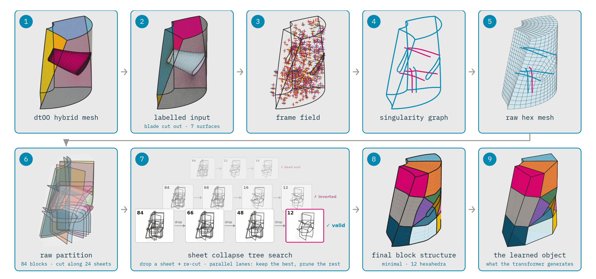

# domain_partition_3D

## The 3D pipeline at a glance



1. **dtOO hybrid mesh** — our parametric design system, design tool
   Object-Oriented ([dtOO](https://github.com/ihs-ustutt/dtOO)), generates the
   geometry and a hybrid mesh: tetrahedra in the passage, boundary-layer prisms on hub and
   shroud, the blade wrapped in a hexahedral O-grid (magenta).
2. **Labelled input** — the O-grid is cut out and the boundary labelled into
   7 patches (inlet, outlet, 2 periodic, 2 boundary-layer interfaces, the
   O-grid cut face). Labels come from the mesh's own tagged 2D elements, never
   from coordinate thresholds.
3. **Frame field** — AlgoHex computes one octahedral frame per tetrahedron,
   stored as a quaternion, aligned with the geometry near the walls.
4. **Singularity graph** — a field on a twisted geometry cannot stay regular;
   its rotation defects concentrate on singular edges (valence 3 magenta,
   valence 5 cyan) that chain into arcs reaching the boundary. The graph
   emerges from the field, it is not an input.
5. **Raw hex mesh** — integrability optimisation, the seamless parametrisation
   as an integer-grid map (IGM) and hexahedral mesh extraction (HexEx) give
   the fine hex mesh, which inherits the singularity graph
   exactly.

6. **Raw partition** — separatrix sheets spanned from the singular edges cut
   the mesh into the raw block partition (base_a: 24 sheets, 84 blocks). The
   sheets cross each other, which is why it over-segments.
7. **Sheet collapse tree search** — a collapse drops one sheet, re-cuts and
   checks whether the result is still a valid block structure. A beam search
   runs many such multi-step chains in parallel and keeps the best; the
   picture shows three real lanes of the base_a tree (winner 84 → 66 → 48 → 12
   in front, a lane rejected for inverted cells and a dead end behind it).
8. **Final block structure** — the minimal 12 hexahedral blocks.
9. **The learned object** — the same structure with straight edges: what the
   transformer in `meshtron` generates.

The figure is rendered from `vtk/22_full_series/base_a` by
`render_blockgen_deck_style.py` in the SPP 2026 slide deck.

## Why a beam search

The singularity graph and the raw partition are identical across runs of the
same geometry. All variability came from the collapse: the earlier greedy
cleanup (`clean_blocks.collapse_mesh_sheets`) stops at the first local
optimum, so one geometry (machine_0004) ended at 12, 22 or 75 blocks depending
on which sheet fell first — label noise in the dataset. The beam search over
collapse orders (`beam_collapse.py`) keeps the best few states per depth
instead of one and reaches the same minimal structure from every start: 17 of
17 runs end at 12 blocks / 12 cuboids, 0 inverted cells, validator VALID, one
shared topology.

- [`2026-09-28-beam-collapse-relabelling.md`](docs/decisions/2026-09-28-beam-collapse-relabelling.md) —
  the finding, the decision and the measurements.
- [`2026-09-30-cutset-search-not-a-collapse-substitute.md`](docs/decisions/2026-09-30-cutset-search-not-a-collapse-substitute.md) —
  why a search over block-level cut sets (`sheet_beam.py`, ~10 s) is *not* a
  substitute: it reaches 25 blocks at best, because uniting sheets lacks the
  vertex welds of the cell-level collapse. It stays as a cheap audit tool.

## Running the 3D route

Everything below lives in `experimentell/hex3d_algohex/`. One sample, end to
end — AlgoHex, block postprocessing, transfinite interpolation (TFI), export — all logs inside `<outdir>`:

```bash
scripts/sample_one.sh <tet.vtk> <n> <outdir> [params.json]
```

It is idempotent (an existing `sample.npz` exits 0 at once) and its exit code
names the failing stage (2 AlgoHex, 3 clean_blocks, 4 tfi, 5 export). `n` is
AlgoHex's target cell count (`-n`); the dataset uses 2000 and 8000 as a pair.

The beam-search collapse on an AlgoHex result (`.ovm`, OpenVolumeMesh) or on a
saved `blocks.vtk`:

```bash
python beam_collapse.py <hex.ovm|blocks.vtk> --input-vtk <tet.vtk> \
    --out <blocks_beam.vtk> --width 16 --depth 6 --guard struct
```

At dataset scale:

- `scripts/generate_machines.py` — Sobol samples (a low-discrepancy sequence)
  of the 30 dtOO design parameters, seeded and incremental, one `params.json`
  and `mesh.msh` per machine.
- `scripts/batch_samples.slurm`, `scripts/batch_generate.slurm` — many
  `sample_one.sh` lanes per node on the cluster (enroot containers, no
  Docker).

A sample is one `sample.npz` (~0.45 MB): the block corners and hexahedra, the
quad faces, every block edge as a polyline and as a cubic Bézier curve
(`edge_ctrl`), the edge direction classes, the labelled surface triangulation
and the design parameters.

Further reading, in this order:

| file | what it holds |
|---|---|
| `experimentell/hex3d_algohex/HANDOFF.md` | current state, reproduce commands, open defects, traps |
| `experimentell/hex3d_algohex/README.md` | the stages, the AlgoHex runs v1–v18, modules |
| `experimentell/hex3d_algohex/DATASET_PIPELINE.md` | the dataset plan, task by task |
| `experimentell/hex3d_algohex/DATA_GENERATION.md` | how the geometries are generated (dtOO) |
| `docs/cluster-enroot-findings.md` | every cluster-side trap |
| `docs/decisions/` | decision logs: what was chosen, and what was rejected |
| `docs/LITERATURE.md` | every source we lean on, by role, with status |

## The 2D surface route

1. **Extraction** (`dp3d/extraction.py`): hub/shroud surfaces from a Gmsh 2.2
   MSH volume mesh via geometric region tags (hub=1, shroud=2), written as
   STL. Optionally (`--include-boundary`) the block-structured boundary-layer
   quad meshes of the hex core.
2. **Cylinder unwrap** (`dp3d/unwrap_surface.py`): isometric unroll to the 2D
   `(s, t)` domain (`s = r·theta`, `t = z`).
3. **Cross field + separatrices** (`dp3d/field/`, `dp3d/partition_surface.py`):
   4-rotational-symmetry (4-RoSy) frame field, singularity detection, streamline integration, Xiao
   2020 merging/snapping.
4. **Block partition** (`dp3d/tmesh.py`, `dp3d/xiao.py`):
   - `ta` — periodic seam as wall, master-slave seam symmetrisation, hanging
     T-nodes (DLR Sauer/Morsbach 2023 sec 2.7).
   - `tb` — like `ta`, but hanging seam junctions are continued into the
     domain.
   - `xiao` — pure Xiao 2020 baseline, no seam postprocessing, no TFI.
5. **TFI fill** (`ta`/`tb`): conforming cell counts per edge from a mixed-integer linear program (MILP), tanh
   blade-boundary-layer clustering, Coons patches + Thomas-Middlecoff
   smoothing.

Why the 3D route replaced it: hub and shroud cross fields are topologically
different (hub four index −1 singularities, shroud four index +1 — a real
effect of blade twist). A per-surface 2D field with a ruled lift cannot
represent that; a 3D field does natively.

```bash
pip install -r requirements.txt

# full pipeline from the volume mesh
python domain_partition.py data/T1_9/T1_9_ru_gridGmsh.msh --part hub

# several methods, showcase plots, boundary-layer quad blocks
python domain_partition.py data/T1_9/T1_9_ru_gridGmsh.msh \
    --part both --method ta tb xiao --plots --include-boundary

# start from an already extracted surface
python domain_partition.py data/T1_9/T1_9_hub_raw.stl --method ta --plots
```

Flags: `--part hub|shroud|both` (default hub), `--method ta tb xiao all`
(default ta), `--plots` (showcase step series), `--include-boundary` (MSH input
only), `--output DIR` (default `output/`).

Outputs: `output/<part>/tmesh_metrics_<tag>.json`, `output/<part>/xiao/` text
report + metrics, `output/extracted/` STL + boundary quad VTK. With `--plots`
one showcase series lands in `output/plots/` (steps 01–07 per part, 08–11 per
method).

## Layout

```
experimentell/
  hex3d_algohex/        the 3D route: AlgoHex -> block structure -> dataset
    scripts/            one-sample and batch drivers, cluster setup
  gmsh_pipeline/        alternative Gmsh Algorithm-11 quad pipeline
  3d_extrapolation/     hub master export, hub->shroud transfer, hexa blocks
domain_partition.py     CLI entry of the 2D surface route
dp3d/                   the 2D surface route
  field/                vendored 2D cross-field tools (torch-based)
  extraction.py         MSH -> hub/shroud STL, boundary quad blocks
  unwrap_surface.py     cylinder unwrap 3D -> 2D
  partition_surface.py  periodic field, snapping, seam logic
  tmesh.py, xiao.py     T-a/T-b pipeline + TFI, Xiao 2020 baseline
  plotting.py           analysis + showcase plots
data/T1_9/              T1_9 test case (source MSH/STL, raw surfaces)
docs/                   decisions, literature, cluster findings, figures
external_patches/       Dockerfile patches for the AlgoHex build
```

## Known issues / TODO

- **Dataset relabelling with the beam search** is decided but not wired in:
  `scripts/sample_one.sh` still runs the greedy `clean_blocks.py`. The batch
  scripts should call `beam_collapse.patch` instead of `--collapse-rounds 5`;
  existing samples are relabelled beside the original (`sample_beam.npz`),
  never overwritten.
- **Shroud partition** (2D route) fails; hub runs clean.
- **Boundary quad filter** (`--include-boundary`): the radius-percentile
  criterion also catches exterior faces that are not on the hub/shroud
  cylinder; needs a proper cylinder-distance test.
- `experimentell/3d_extrapolation/` still assumes the pre-refactor
  `run_tmesh` defaults.
