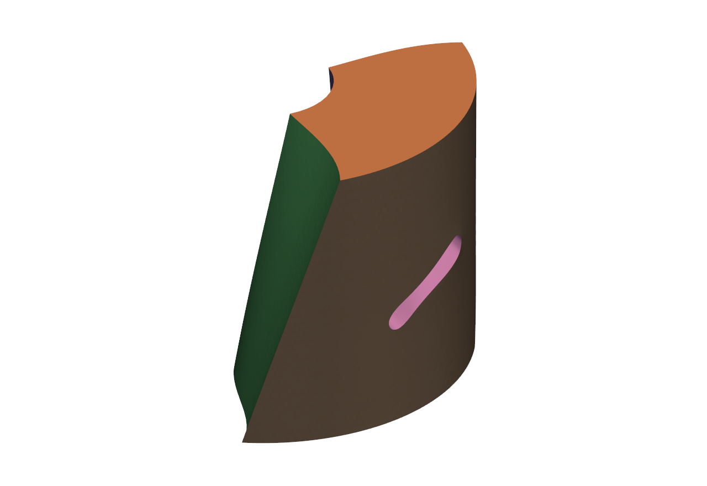
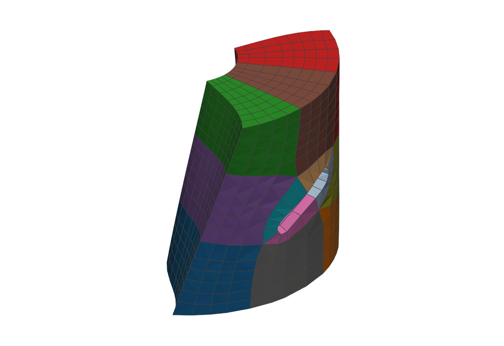
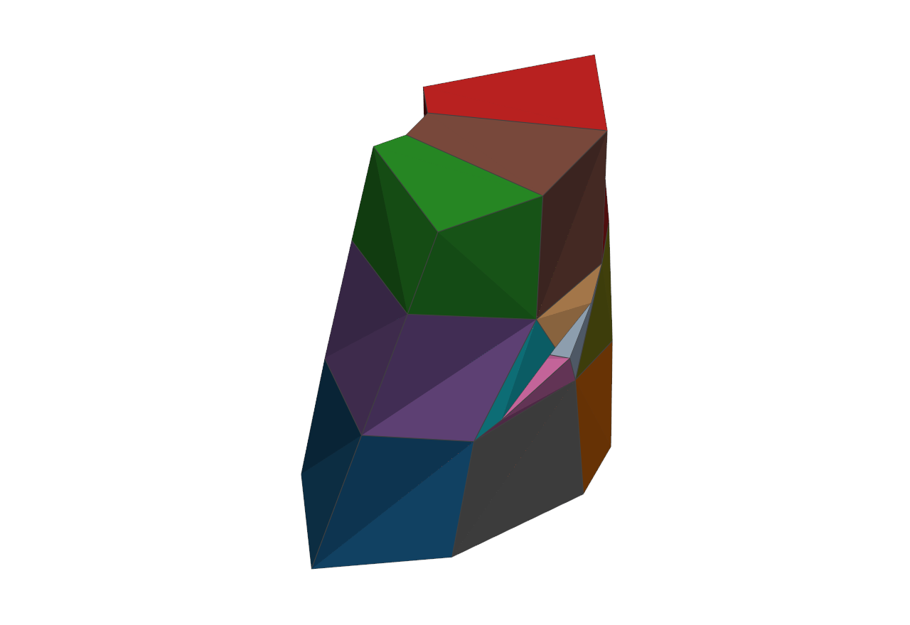
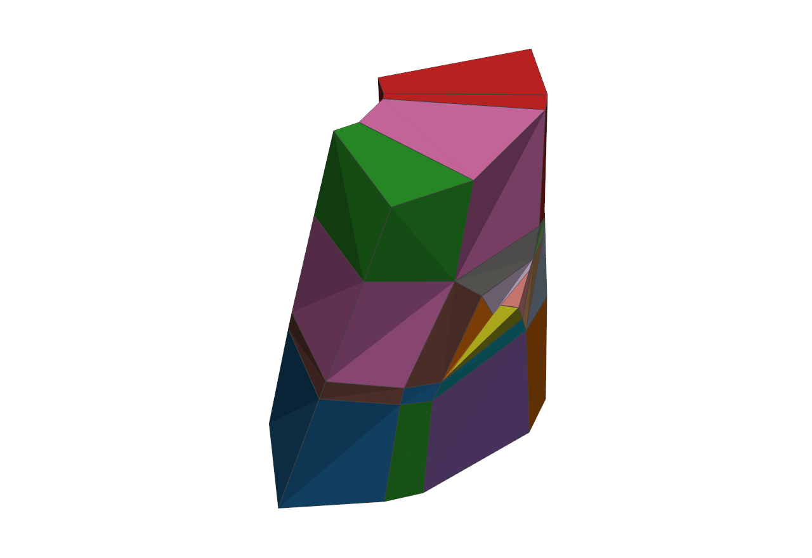
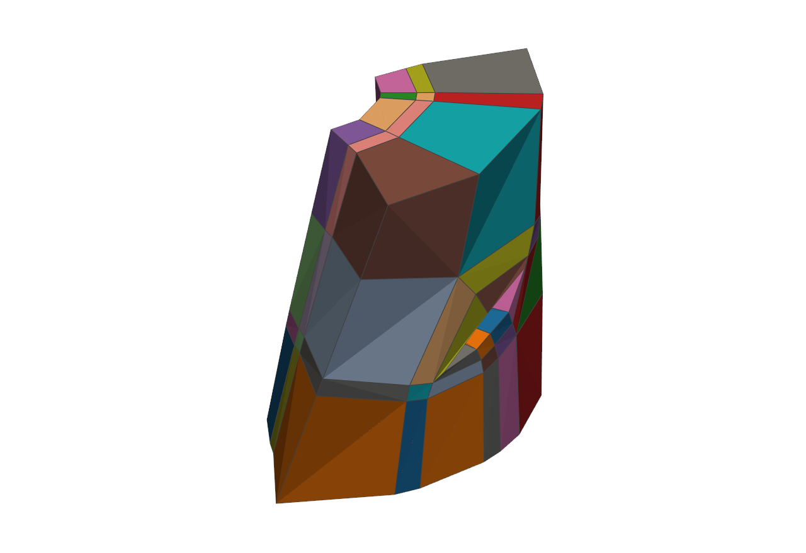
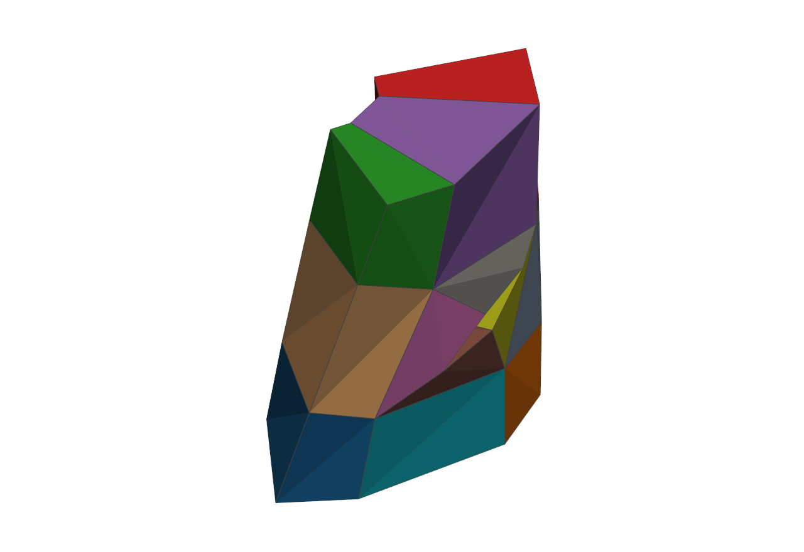

# domain_partition_3D

Block-structured quad domain partition of cylindrical turbomachinery
surfaces (hub/shroud). Standalone — the cross-field tools from
`domain_partition_2D` are vendored under `dp3d/field/`.

## The pipeline at a glance

The 3D path that produces the training data for the block-structure
transformer. Geometry in, minimal block structure out:

| geometry | AlgoHex hex mesh | greedy cleanup: 12 blocks | greedy cleanup: 22 blocks | greedy cleanup: 75 blocks | beam search: 12 blocks |
|---|---|---|---|---|---|
|  |  |  |  |  |  |

One geometry (machine_0004), three greedy cleanup runs: the singularity
graph and the raw base complex (84 blocks) are identical, but the greedy
sheet collapse stops in a different local optimum each time — 12, 22, or
75 blocks depending on which sheet falls first. The beam search over
collapse orders (`experimentell/hex3d_algohex/beam_collapse.py`) reaches
the same minimal structure from every start: 17 of 17 runs so far end at
the same 12-block / 12-cuboid topology, 0 inverted cells, validator
VALID. Why the greedy cleanup was the label noise — and why the beam
search fixes it — is in
[`docs/decisions/2026-09-28-beam-collapse-relabelling.md`](docs/decisions/2026-09-28-beam-collapse-relabelling.md).

The block structures and finer machinery of the learned side live in the
[`meshtron`](../meshtron) repo; see its "three pipelines at a glance"
section for the Quadtron and Polytron rows.

## Pipeline

1. **Extraction** (`dp3d/extraction.py`): hub/shroud surfaces from a
   Gmsh 2.2 MSH volume mesh via geometric region tags (hub=1, shroud=2),
   written as STL. Optionally (`--include-boundary`) the block-structured
   boundary-layer quad meshes of the hex core.
2. **Cylinder unwrap** (`dp3d/unwrap_surface.py`): isometric unroll of the
   cylindrical 3D surface to the 2D `(s, t)` domain
   (`s = r·theta`, `t = z`).
3. **Cross-field + separatrices** (`dp3d/field/`, `dp3d/partition_surface.py`):
   4-RoSy frame field, singularity detection, streamline integration,
   Xiao 2020 merging/snapping.
4. **Block partition** (`dp3d/tmesh.py`, `dp3d/xiao.py`):
   - `ta` — Ansatz T-a: periodic seam as wall, master-slave seam
     symmetrization, hanging T-nodes (DLR Sauer/Morsbach 2023 sec 2.7).
   - `tb` — Ansatz T-b: like T-a, but hanging seam junctions are continued
     into the domain.
   - `xiao` — pure Xiao 2020 baseline, no seam postprocessing, no TFI.
5. **TFI fill** (ta/tb): conforming cell counts per edge (MILP), tanh
   blade-boundary-layer clustering, Coons patches + Thomas-Middlecoff
   smoothing.

## Usage

```bash
pip install -r requirements.txt

# full pipeline from the volume mesh
python domain_partition.py data/T1_9/T1_9_ru_gridGmsh.msh --part hub

# several methods, showcase plots, boundary-layer quad blocks
python domain_partition.py data/T1_9/T1_9_ru_gridGmsh.msh \
    --part both --method ta tb xiao --plots --include-boundary

# start from an already extracted surface
python domain_partition.py data/T1_9/T1_9_hub_raw.stl --method ta --plots
```

Flags: `--part hub|shroud|both` (default hub), `--method ta tb xiao all`
(default ta), `--plots` (showcase step series), `--include-boundary`
(MSH input only), `--output DIR` (default `output/`).

Outputs: `output/<part>/tmesh_metrics_<tag>.json`, `output/<part>/xiao/`
text report + metrics, `output/extracted/` STL + boundary quad VTK. With
`--plots` a single showcase series lands in `output/plots/`: steps 01-07
once per part (surface, unwrap, cross-field, representatives, frame field,
singularities, streamline integration plain + labeled), steps 08-09 per
method plain + labeled (simplification, final blocks), steps 10-11 per
method (TFI grid, tiled periodicity check -- ta/tb only). All steps share
the faint triangulated background and the same (s,t) domain aspect.

## Layout

```
domain_partition.py     CLI entry
dp3d/                   pipeline package
  field/                vendored 2D cross-field tools (torch-based)
  extraction.py         MSH -> hub/shroud STL, boundary quad blocks
  unwrap_surface.py     cylinder unwrap 3D -> 2D
  dp_adapter.py         2D mesh -> torch_geometric Data
  partition_surface.py  periodic field, snapping, seam logic
  tmesh_faces.py        T-mesh block extraction
  tmesh.py              T-a/T-b pipeline + TFI
  xiao.py               Xiao 2020 baseline
  plotting.py           analysis + showcase plots
data/T1_9/              T1_9 test case (source MSH/STL, raw surfaces)
docs/
  LITERATURE.md         every source we lean on, by role, with status
  decisions/            decision logs: what was chosen, and what was rejected
experimentell/
  gmsh_pipeline/        alternative Gmsh Algorithm-11 quad pipeline
  3d_extrapolation/     hub master export, hub->shroud transfer, hexa blocks
  hex3d_algohex/        3D route: AlgoHex -> block complex -> dataset
```

## Known issues / TODO

- **Shroud partition** fails (hub runs clean); fixes pending.
- **Boundary quad filter** (`--include-boundary`): the radius-percentile
  criterion also catches exterior faces that are not on the hub/shroud
  cylinder; needs a proper cylinder-distance test.
- `experimentell/3d_extrapolation/` imports are updated to dp3d, but the
  scripts still assume the pre-refactor `run_tmesh` defaults; revisit when
  the shroud transfer is picked up again.
