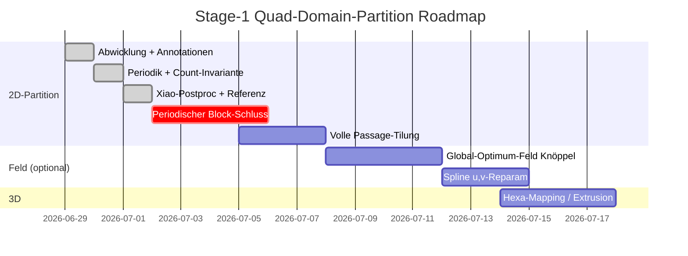

# Stage-1 Quad-Domain-Partition Dashboard

> [!summary] Projekt-Status
> **Branch:** `wip-backup` | **Main:** `master`
> **Pipeline:** 🟡 2D-Partition steht, Passage-Tilung offen | **3D-Mapping:** 🔴 Pending
> **Letzter Commit:** `10be3e7` — Pitchwise-Periodik + Xiao Streamline-Postproc
> **Bester Stand:** 13 Blöcke, 0 invertiert, 3 irregulär (pure Xiao, tips OFF)

---

## 🎯 Aktive Ziele

| Ziel | Status | Blocker | Nächster Schritt |
|------|--------|---------|------------------|
| Periodischer Block-Schluss | 🔴 Nicht gestartet | Naht als Wand in Streamline-Stufe | `QuadFaceGenerator`/`Splitter` lesen, Periodik reinziehen |
| Volle Passage-Tilung | 🔴 Blocked | Außenkanäle ungetilt (Euler≠0) | Naht-Continuation im Postprocessor (Monkeypatch) |
| Architektur A vs B | 🟡 Offen | Entscheidung | eigenes `_snap` behalten (5 Blk PASS) vs pure Xiao (13 Blk) |
| Tip-Cluster sauber | 🟡 Offen | 3 nahe Ziele je Tip | nicht per Snap-Heuristik lösen |
| 3D-Mapping / Hexa | 🟢 Offen | saubere 2D-Partition nötig | nach Tilung |

---

## 📊 Experiment-Status

> [!tip] Neue Läufe hier eintragen. (Hub T1_9)

| Experiment | Status | Config | Ergebnisse | Notizen |
|-----------|--------|--------|-----------|---------|
| Baseline Wand-berandet | ✅ Done | non-periodic | 19 Blk, Euler=−1, 1 irreg | Interior-Sing topologisch fix |
| + Periodik (θ-Naht) | ✅ Done | periodic, tips AN | 5 Blk, 0 inv, SJ 0.66, PASS | Außenkanäle ungetilt (Euler=7) |
| Tips AUS (glattes Blade) | ✅ Done | `set_blade_tip_corners(False)` | 3 Blk, 8 irreg | schlechter |
| **pure Xiao (custom `_snap` AUS)** | ✅ **Best** | tips OFF, Merging Fall1+2 | **13 Blk, 3 irreg, 0 inv** | committed `10be3e7` |
| prefer-sing Snapping | ❌ Revert | Nearest + prefer | got=4, 4 Blk | BACKFIRE ×2 |
| **Passage-Tilung** | 🔴 Geplant | periodic Block-Schluss | — | **NÄCHSTES** |

---

## 🔥 Offene Blocker

> [!warning] Diese Items blocken Fortschritt

**Manuelle Liste (falls Dataview nicht installiert):**

- [ ] Naht als Wand in Streamline-Stufe → Außenkanäle ungetilt `priority::critical`
- [ ] `QuadFaceGenerator` schließt 4-Seiter nicht über ganze Passage `priority::high`
- [ ] Tip-Cluster (3 nahe Ziele) → Wraps snappen falsch `priority::medium`

---

## ✅ Offene Aufgaben (Alle)

### Dringend
- [ ] **Periodischer Block-Schluss** — Periodik in Streamline-/Block-Stufe ziehen; Naht-Continuation Monkeypatch im Postprocessor
- [ ] **`QuadFaceGenerator` + `Splitter` lesen** — `streamlines_to_quad_faces.py`: warum 4-Seiter nicht über Passage schließen

### Wichtig
- [ ] Architektur A (eigenes `_snap`, 5 Blk PASS) vs B (pure Xiao, 13 Blk) entscheiden
- [ ] Tip-Cluster sauber lösen (2 Feld-Sing + C0-Ecke je Tip) — nicht per Snap-Heuristik
- [ ] Ergebnisse dokumentieren (Plots: `blocks_2d.png`, `separatrices.png`, `xiao_postproc.png`)

### Optional / Langfristig
- [ ] Phase 3 — Global-Optimum-Frame-Field (Knöppel 2013, Connection-Laplacian + `eigsh`)
- [ ] Spline u,v-Reparametrisierung (90°-Ecken by construction)
- [ ] 3D-Mapping / Hexa-Extrusion der 2D-Blöcke

---

## 📈 Partition-Metriken (Live)

> [!note] Nach jedem Lauf aktualisieren.

| Metrik | Baseline (Wand) | + Periodik | pure Xiao (best) | Ziel |
|--------|-----------------|-----------|------------------|------|
| Blöcke | 19 | 5 | 13 | — |
| Invertiert | 0 | 0 | 0 | 0 |
| Irreguläre Innenknoten | 1 | 0 | 3 | 0 |
| Euler-Charakteristik | −1 | 7 | ≠0 | **0** |
| Scaled-Jacobian min | 0.79 | 0.66 | — | > 0.5 |
| Count-Invariante (3/5) | PASS | PASS | — | PASS |
| Passage-Abdeckung | Teil | Wrap-Region | Wrap + mehr | **voll** |

---

## 🔗 Schnell-Links

### Doc
- [[stage1-domain-obsidian]] — Haupt-Tracker (Tasks, Experimente, Daily Log, Theorie)
- [[scripts/stage1/PROGRESS]] — lebendes Iterations-Log (Iter 3–6)
- [[scripts/stage1/HANDOFF]] — Kontext-Transfer + Constraints
- [[overview]] — T1_9 Gesamt-Status | [[PLAN]] — reg_geom-Tabelle

### Stage-1-Code (`scripts/stage1/`)
- `unwrap_surface.py` — 3D→2D Abwicklung, corner_type, periodic_pairs
- `dp_adapter.py` — `MeshData`-Bau für domain_partition
- `partition_surface.py` — **KEY**: seam-aware Solve + Monkeypatches + `validate()`
- `clean_separatrix.py` — Emanation 3/5-Invariante
- `plot_results.py` / `plot_xiao_postproc.py` / `compare_tip_modes.py` — Viz

### Solver (nur lesen, `../domain_partition/tools/`)
- `frame_field.py` — Cross-Field (harmonisch + Dirichlet)
- `singularity_detector.py` — Singularitäten
- `streamline_generator_v2.py` — Integration
- `streamline_postprocessor.py` — `StreamlineMerging` (Alg. 2)
- `streamlines_to_quad_faces.py` — `QuadFaceGenerator`

---

## 🗺️ Roadmap



---

## 🐛 Bekannte Bugs — Live-Status

| Bug | Schwere | Status | Workaround | Datei |
|-----|---------|--------|-----------|-------|
| Außenkanäle ungetilt (Naht=Wand) | 🔴 High | 🔴 Offen | — | `streamline_generator_v2.py` |
| Tip-Cluster-Snapping | ⚠️ Medium | 🔴 Offen | 3 Ziele je Tip | `partition_surface.py` `_snap` |
| `detect_singularities`-Warnung | ℹ️ Info | 🟡 Fehlalarm | ignorieren (nicht-periodische Euler) | `singularity_detector.py` |
| Fall 2 Dead Code | ⚠️ Medium | 🟢 Gefixt | Monkeypatch reaktiviert | `partition_surface.py` |
| `bc_weight` wirkungslos | ℹ️ Info | 🟡 Akzeptiert | default `None` (hart) | `partition_surface.py` |
| `_annihilate_pairs` bricht Wrap | ⚠️ Medium | 🟡 Akzeptiert | default OFF | `partition_surface.py` |
| dp-venv fehlt meshio | ⚠️ Low | 🟢 Workaround | `/root/venv/bin/python` | — |

---

## 📋 Daily Standup (Letzte 3 Tage)

> [!example] Kurze Updates — max 3 Bullets pro Tag

**2026-07-01**
- ✅ Xiao 2020 als exaktes Postproc-Paper identifiziert; Fall 2 (`find_missed`) per Monkeypatch reaktiviert
- ✅ pure Xiao (custom `_snap` AUS, tips OFF) → 13 Blöcke, 0 inv = bester Stand
- ✅ Committed + gepusht `10be3e7`

**2026-06-30**
- ✅ Pitchwise-Periodik (θ-Naht) — Naht-Stetigkeit 0.0, 36 Paare, pitch=π/4
- ✅ Innere Blade-Umfeld-Singularitäten weg; Count-Invariante 3/5 + Validator PASS
- ✅ Befund: Euler-Defekt aus Existenz innerer Feld-Sing, nicht aus Count

**2026-06-29**
- ✅ Abwicklung mit corner_type + blade_loops; `_emanate_from_blade_tips`
- ✅ `validate()` mit `QuadPartitionValidator(strict=True)` → Report
- ✅ Annotierter Block-Plot (irreg/inv/high-aspect)

---

## 🛠️ Werkzeuge & Befehle

### Pipeline laufen (Hub)
```bash
/root/venv/bin/python scripts/stage1/partition_surface.py
# → output/T1_9/hub_stage1/{blocks_2d.png, separatrices.png, validation_report.txt}
```

### Pure-Xiao-Postproc plotten
```bash
/root/venv/bin/python scripts/stage1/plot_xiao_postproc.py
# → output/T1_9/hub_stage1/xiao_postproc.png
```

### Blade-Tip-Ecken ON vs OFF vergleichen
```bash
/root/venv/bin/python scripts/stage1/compare_tip_modes.py
# → output/T1_9/hub_stage1/compare_tip_modes.png
```

### Toggles (im Code / interaktiv)
```python
import unwrap_surface as us, partition_surface as ps
us.set_blade_tip_corners(False)   # LE/TE-C0-Ecken aus (glattes Blade)
ps.set_periodic(True)             # θ-Naht periodisch (default)
ps._snap_separatrix_endpoints = lambda mesh, radius=0.045, bnd_radius=0.05: None  # pure Xiao
```

---

## 📁 Datei-Struktur

```
/root/repos/block_structured_meshing/
├── scripts/stage1/
│   ├── unwrap_surface.py          ← 3D→2D Abwicklung
│   ├── dp_adapter.py               ← MeshData-Bau
│   ├── partition_surface.py        ← KEY: Solve + Monkeypatches + validate()
│   ├── clean_separatrix.py         ← Emanation 3/5
│   ├── plot_results.py             ← Viz
│   ├── plot_xiao_postproc.py       ← pure-Xiao-Plot
│   ├── compare_tip_modes.py        ← Tip-Ecken-Vergleich
│   ├── PROGRESS.md                 ← Iterations-Log
│   └── HANDOFF.md                  ← Kontext-Transfer
├── output/T1_9/hub_stage1/         ← Plots + validation_report.txt
├── T1_9_hub_raw.stl                ← Input
├── overview.md / PLAN.md           ← T1_9-Status + reg_geom-Tabelle
├── stage1-domain-obsidian.md       ← Haupt-Tracker
└── dashboard-stage1-partition.md   ← ← Dieses Dashboard

/root/repos/domain_partition/       ← Solver (nur lesen/monkeypatchen)
└── tools/{frame_field, singularity_detector, streamline_*, streamlines_to_quad_faces}.py
```

---

## 🎯 Definition of Done

> [!success] Wann ist Stage-1 "fertig"?

- [x] 3D→2D-Abwicklung isometrisch + Annotationen
- [x] Pitchwise-Periodik (Naht-Stetigkeit 0.0)
- [x] Seam-aware Cross-Field + Singularitäten (Index-Summe = χ)
- [x] Separatrix-Count-Invariante 3/5 + Validator
- [ ] **Volle Passage in Vier-Seiter zerlegt** (Euler=0, 0 irreguläre Innenknoten)
- [ ] Periodischer Block-Schluss über die θ-Naht
- [ ] Block-Mesh besteht `is_valid()` + `passes_soft_thresholds()`
- [ ] 3D-Mapping / Hexa-Extrusion produziert gültige Blöcke
- [ ] Shroud-Fläche analog partitioniert

---

## 🔄 Wie dieses Dashboard nutzen

### Ohne Plugins
- Als Markdown lesen; Checkboxen manuell (`- [ ]` → `- [x]`); Tabellen manuell pflegen

### Mit Obsidian + Dataview
- Tasks filtern/aggregieren; Experiment-Tabellen dynamisch ziehen; Dashboard als Startseite

### Mit Obsidian + Mermaid
- Roadmap-Gantt + Pipeline-Graph direkt rendern

---

*Dashboard erstellt: 2026-07-01*
*Nächste Aktualisierung: nach periodischem Block-Schluss / Passage-Tilung*
