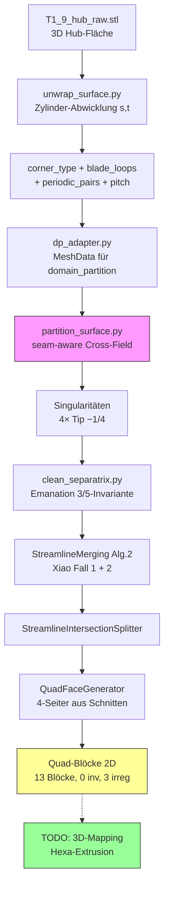

# Stage-1 Quad-Domain-Partition — T1_9 Hub

> [!note] Projekt-Übersicht
> Automatische **Hexa-Block-Struktur** eines Turbinen-Runners (T1_9). Eigene Pipeline, weg von Gmsh:
> 3D-Hub-Fläche → 2D-Zylinder-Abwicklung `(s,t)=(r·θ, z)` → boundary-aligned **Cross-Field** (4-RoSy)
> → **Singularitäten** → **Streamline-Integration** → **Quad-Domain-Partition**.
> Solver in `../domain_partition/tools/`, Stage-1-Glue in `scripts/stage1/`.

---

## Schnell-Status

| Komponente | Status | Letzter Test | Notizen |
|-----------|--------|-------------|---------|
| Zylinder-Abwicklung | ✅ Fertig | 2026-06-30 | `unwrap_surface.py`, isometrisch, corner_type + blade_loops |
| Pitchwise-Periodik (θ-Naht) | ✅ Fertig | 2026-06-30 | 36 conforme Paare, pitch=π/4 (8 Blades), Naht-Stetigkeit 0.0 |
| Cross-Field (seam-aware) | ✅ Fertig | 2026-07-01 | harmonisch Laplace+Dirichlet+normalize, Naht verschweißt |
| Singularitäten-Erkennung | ✅ Fertig | 2026-07-01 | 4 Tip-Sing (je −1/4), geom. Index-Summe = χ |
| Separatrix-Emanation (3/5) | ✅ Fertig | 2026-06-30 | Count-Invariante erzwungen + Validator PASS |
| Streamline-Postproc | 🟡 Teilweise | 2026-07-01 | Xiao Fall 1 aktiv, Fall 2 reaktiviert; Wraps schließen halb |
| Block-Erzeugung | 🟡 Teilweise | 2026-07-01 | 13 Blöcke, 0 invertiert, 3 irreg — Außenkanäle ungetilt |
| **Periodischer Block-Schluss** | 🔴 **Offen** | — | **NÄCHSTER SCHRITT** — volle Passage-Tilung |
| 3D-Mapping / Hexa-Extrusion | 🔴 Offen | — | nach sauberer 2D-Partition |

---

## Pipeline (Mermaid)

---

## Theorie-Grundlagen

> [!info] Kern-Invarianten (Literatur)

| Konzept | Regel | Quelle |
|---------|-------|--------|
| Cross-Field | 4-RoSy, Repräsentant `(cos4θ, sin4θ)` | Knöppel 2013 |
| Separatrix-Count | Index +1 → **genau 3**; Index −1 → **genau 5** | Kowalski Prop 9 |
| Vier-Seiter-Garantie | nur bei vollem Separatrix-Satz pro Sing | Kowalski §3.2.3 |
| Holonomie-Budget | `i0 = l − k + Σiᵢ`,  `Smin = \|i0 − Σiᵢ\|` | Kowalski Eq 14/20 |
| Poincaré-Hopf | Σ Index = χ (χ=0 für periodischen Zylinder) | — |
| Streamline-Merge | Winkel Gl. 9: 3-val 120–240°, 5-val 144–216° | Xiao 2020 §4.2.2 |
| Merge-Blend | `γ12(s)=(1−s)γ1(s)+s·γ2(s)` (Gl. 10) | Xiao 2020 / Kowalski Eq 28 |

---

## Design-Entscheidungen

> [!success] Festgelegt

| Thema | Entscheidung | Begründung |
|-------|-------------|------------|
| Abwicklung | Zylinder `(s,t)=(r·θ, z)` | isometrisch, reine s-Translation |
| θ-Ränder | **periodisch** (nicht Wand) | Pitch physikalisch periodisch → korrekte Holonomie |
| Frame-Field | harmonisch + Dirichlet + normalize | Bestand aus domain_partition; Knöppel-Global = Phase 3 |
| Blade-Tips | **beide** Feld-Sing nutzen | User-Ansage — nicht zu 1 Knoten zusammenfassen |
| LE/TE-C0-Ecken | AN (default) | Boundary-Split-Andockpunkte; AUS → schlechter (Iter 5) |
| Snapping (`_snap`) | pure Xiao (custom AUS) | bestes Ergebnis: 13 Blöcke, 3 irreg, 0 inv |
| Außenecken (Sing) | löschen; Tips (==1) verschonen | nur echte Feld-Sing tragen Blade-Wrap |
| domain_partition-Repo | **keine Edits** — nur Monkeypatch | HANDOFF-Constraint |

---

## Offene Aufgaben

> [!todo] Nächste Schritte — Priorisiert

### 🔴 Blocker / Dringend

- [ ] **Periodischer Block-Schluss / volle Passage-Tilung** `priority::critical`
  - Feld ist periodisch, aber `StreamlineGenerator_v2`/`StreamlinePostProcessor` behandeln
    die schrägen Naht-Seiten noch als WAND → Separatrizen laufen nicht über die Naht →
    Außenkanäle (oben-links/unten-rechts Parallelogramm) bleiben ungetilt.
  - **Aktion:** Periodik in die Streamline-/Block-Stufe ziehen (Naht-Continuation +
    periodischer Block-Schluss). Monkeypatch im Postprocessor. Plan-Datei Phase 2c-Folge.

- [ ] **`QuadFaceGenerator` + `StreamlineIntersectionSplitter` verstehen** `priority::high`
  - Quelle `streamlines_to_quad_faces.py` lesen: warum 4-Seiter NICHT über die ganze
    Passage (Blade-Ring + Naht) schließen. Eigentlicher Tiling-Blocker.

### 🟡 Wichtig

- [ ] **Architektur A vs B entscheiden**
  - (A) eigenes `_snap` behalten (macht Boundary-T-Junctions) + StreamlineMerging Fall-1-Ergänzung → 5 Blöcke PASS
  - (B) `_snap` fallenlassen, ganz auf domain_partition StreamlineMerging (Fall 1+2) → 13 Blöcke, aber irreg (pure Xiao)
- [ ] **Tip-Cluster sauber lösen** (nicht per Snap-Heuristik)
  - je Tip klumpen 3 fast-gleiche Ziele (2 Feld-Sing + 1 C0-Ecke); Wraps snappen falsch auf Ecke.

### 🟢 Optional / Langfristig

- [ ] **Phase 3 — Global-Optimum-Frame-Field (Knöppel 2013)** `priority::low`
  - Connection-Laplacian + `eigsh` (smallest) statt harter Dirichlet-BC. Evtl. 1 saubere Sing/Tip.
- [ ] **Spline u,v-Reparametrisierung** — 90°-Ecken by construction (schräge 2D-Außenecken vermeiden)
- [ ] **Gegenprobe** am einfachen 90°-Testcase — darf nicht regredieren.

---

## Experiment-Tracking

> [!note] Läufe (Hub T1_9)

| Experiment | Status | Config | Ergebnis | Notizen |
|-----------|--------|--------|----------|---------|
| Baseline Wand-berandet | ✅ Done | non-periodic | 19 Blöcke, Euler=−1, 1 irreg | Interior-Sing topologisch fix |
| + Periodik (θ-Naht) | ✅ Done | periodic, tips AN | 5 Blöcke, 0 inv, SJ 0.66, Count PASS | innere Sing weg, Außenkanäle ungetilt (Euler=7) |
| Tips AUS (glattes Blade) | ✅ Done | `set_blade_tip_corners(False)` | 3 Blöcke, 8 irreg | schlechter — Ecken sind Split-Andocker |
| Kowalski §4.3 Blend | ✅ Done | Fall-1 Blend statt Prong-Drop | 2 Paare verschmolzen, Count PASS | Intra-Tip-Verbinder 0↔1, 2↔3 |
| prefer-sing Snapping | ❌ Revert | Nearest + prefer | über-merge, got=4, 4 Blöcke | BACKFIRE ×2, verworfen |
| **pure Xiao (custom `_snap` AUS)** | ✅ **Best** | tips OFF, Merging Fall1+2 | **13 Blöcke, 3 irreg, 0 inv** | committed `10be3e7` |

### Metriken, die getrackt werden

- [x] Block-Anzahl, invertierte Blöcke, irreguläre Innenknoten
- [x] Scaled-Jacobian (min/mean), Innenwinkel-Range, Aspect-Ratio
- [x] Separatrix-Count-Invariante (got vs expected 3/5)
- [x] Euler-Charakteristik des Block-Meshes
- [ ] Volle-Passage-Abdeckung (BOUNDARY-Dist → 0)
- [ ] Naht-periodischer Block-Schluss (links==rechts)

---

## Bekannte Probleme

> [!warning] Bugs & Limitationen

1. **Außenkanäle ungetilt** — Naht als Wand in Streamline-Stufe → `Euler≠0`, irreguläre Innenknoten. **Haupt-Blocker.**
2. **Tip-Cluster-Snapping** — 3 nahe Ziele je Tip (2 Sing + C0-Ecke); Wraps snappen auf falsches Ziel.
3. **`detect_singularities`-Warnung** — Fehlalarm, nutzt nicht-periodische Euler-Zahl.
4. **`find_missed_streamline_endpoints`** — Xiao Fall 2, war Dead Code in domain_partition `__init__` → per Monkeypatch reaktiviert.
5. **`bc_weight` wirkungslos** — Sing-Anzahl topologisch fix durch Rand-Holonomie, nicht via Innen-Energiegewicht steuerbar. Knopf bleibt (harmlos, default `None`).
6. **`_annihilate_pairs` bricht Blade-Wrap** — reine Paar-Löschung verliert load-bearing Bridge-Separatrix. Default OFF.
7. **domain_partition eigenes venv fehlt meshio** — immer `/root/venv/bin/python` nutzen.

---

## Dateien-Referenz

> [!info] Stage-1-Pipeline (`scripts/stage1/`)

| Datei | Zweck | Rolle |
|-------|-------|-------|
| `unwrap_surface.py` | 3D→2D Zylinder-Abwicklung, corner_type, blade_loops, periodic_pairs, pitch | Input |
| `dp_adapter.py` | baut `MeshData` für domain_partition (normalisiert, alle Annotationen) | Glue |
| `partition_surface.py` | **KEY** — seam-aware Field-Solve + alle Monkeypatches + `validate()` | Solver |
| `clean_separatrix.py` | Emanation 3/5-Invariante, Tip-Emission, Außenecken-Löschung | Postproc |
| `plot_results.py` | Separatrizen + Block-Plot → `output/T1_9/hub_stage1/` | Viz |
| `plot_xiao_postproc.py` | pure Xiao (custom `_snap` AUS) → `xiao_postproc.png` | Viz |
| `compare_tip_modes.py` | Blade-Tip-Ecken ON vs OFF Vergleich → `compare_tip_modes.png` | Viz |
| `field_diagnostic.py` | Feld-/Singularitäten-Diagnose | Debug |
| `PROGRESS.md` | lebendes Iterations-Log (Iter 3–6) | Doc |
| `HANDOFF.md` | Kontext-Transfer + Constraints | Doc |

**Solver (nicht editieren, `../domain_partition/tools/`):** `frame_field.py`, `singularity_detector.py`,
`streamline_generator_v2.py`, `streamline_postprocessor.py`, `streamlines_to_quad_faces.py`.

---

## Daten-Locations

- **Input:** `/root/repos/block_structured_meshing/T1_9_hub_raw.stl`
- **Outputs:** `output/T1_9/hub_stage1/` — `blocks_2d.png`, `separatrices.png`, `xiao_postproc.png`,
  `compare_tip_modes.png`, `validation_report.txt`, `unwrap_meta.json`
- **Env:** `/root/venv/bin/python` (meshio + torch + torch_geometric)
- **Solver-Repo:** `/root/repos/domain_partition/` (nur lesen/monkeypatchen)

---

## Git-Status

- **Branch:** `wip-backup`
- **Main:** `master`
- **Remote:** `git@github.com:RentschlerTobias/block_structured_meshing.git`
- **Letzter Commit:** `10be3e7` — "Stage-1: pitchwise periodicity + Xiao streamline postprocessing"
- **Untracked:** `output/T1_9/hub_stage1/validation_blade_nocorner.txt` (bewusst nicht getrackt)

---

## Daily Log

> [!example] Iterations-Log

### 2026-07-01 — Xiao 2020 gefunden + pure Postproc
- Exaktes Referenz-Paper: **Xiao et al 2020** (`literature/1-s2.0-S0955799720300035-main.pdf`) = domain_partition-Referenz-Impl.
- `StreamlineMerging` = Alg. 2: Fall 1 aktiv, Fall 2 (`find_missed_streamline_endpoints`) war Dead Code → Monkeypatch reaktiviert.
- pure Xiao (custom `_snap` AUS) + tips OFF → **13 Blöcke, 3 irreg, 0 inv** = bester Stand. Committed + gepusht `10be3e7`.
- Kowalski §4.3 Blend statt Prong-Drop; Tip-Cluster als eigentlicher Tiling-Blocker identifiziert.

### 2026-06-30 — Periodik + Count-Invariante
- Pitchwise-Periodik (θ-Naht) implementiert + verifiziert (Naht-Stetigkeit 0.0, 36 Paare, pitch=π/4).
- Innere Blade-Umfeld-Singularitäten WEG; an Tips verschoben (4× −1/4, Index-Summe = χ).
- Separatrix-Count-Invariante 3/5 erzwungen + `_validate_separatrix_counts` Validator → PASS.
- Befund: Euler-Defekt kam NICHT vom Count, sondern von Existenz innerer Feld-Sing (−1 = Valenz-5-Knoten).

### 2026-06-29 — Emanation + Annotationen
- `unwrap_surface.py`: corner_type (0=Außen, 1=Tip) + blade_loops.
- `clean_separatrix.py`: `_emanate_from_blade_tips` (3 Cross-Arme, gefiltert per blade_loop-Path).
- `partition_surface.py`: `validate()` mit `QuadPartitionValidator(strict=True)` → Report.
- Annotierter Block-Plot: irreguläre (rot), invertierte (rot gefüllt), High-Aspect (orange).

---

## Verwandte Notizen

- [[dashboard-stage1-partition]] — Dashboard (Status auf einen Blick)
- [[scripts/stage1/PROGRESS]] — lebendes Iterations-Log (Iter 3–6)
- [[scripts/stage1/HANDOFF]] — Kontext-Transfer + Constraints
- [[overview]] — T1_9 Gesamt-Status-Doc
- [[PLAN]] — reg_geom-Tabelle (Part-Zuordnung)

---

*Letzte Aktualisierung: 2026-07-01*
*Status: 13-Block-Partition (0 inv), Passage-Außenkanäle ungetilt*
*Nächste Aktion: periodischer Block-Schluss / volle Passage-Tilung*
